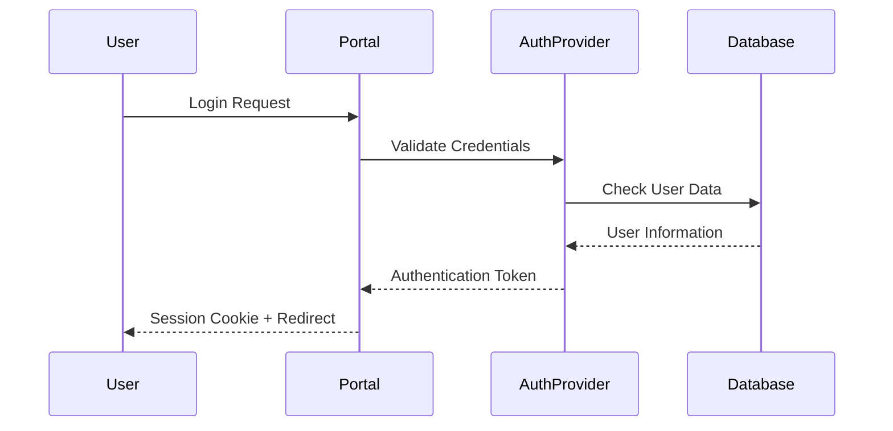

# Security & Authentication Documentation

This document covers the security architecture, authentication mechanisms, and security best practices for the Portal application.

## 🔐 Security Overview

The Portal implements a multi-layered security approach covering:
- **Authentication & Authorization** - User identity and access control
- **Data Protection** - Encryption and secure data handling
- **Network Security** - Transport layer security and API protection
- **Application Security** - Input validation and XSS protection
- **Infrastructure Security** - Server hardening and monitoring

## 🔑 Authentication Architecture

### Authentication Flow



### Supported Authentication Methods

#### 1. Company Credentials (Primary)
- **Method**: Username/Password authentication
- **Integration**: LDAP/Active Directory
- **Session Management**: JWT-based sessions
- **Multi-Factor Authentication**: Optional 2FA support

```typescript
// Authentication configuration
const authConfig = {
  providers: [
    {
      id: "company-ldap",
      name: "Company Login",
      type: "ldap",
      server: process.env.LDAP_SERVER,
      bindDN: process.env.LDAP_BIND_DN,
      bindCredentials: process.env.LDAP_PASSWORD,
      searchBase: "ou=employees,dc=company,dc=com",
      searchFilter: "(uid={{username}})"
    }
  ],
  session: {
    strategy: "jwt",
    maxAge: 8 * 60 * 60, // 8 hours
    updateAge: 24 * 60 * 60, // 24 hours
  }
};
```

#### 2. OAuth Integration (Optional)
- **Google OAuth**: For guest access or external users
- **Microsoft Azure AD**: Enterprise integration
- **SSO Providers**: SAML 2.0 support

```typescript
// OAuth configuration example
const oauthProviders = {
  google: {
    clientId: process.env.AUTH_GOOGLE_ID,
    clientSecret: process.env.AUTH_GOOGLE_SECRET,
    scope: "openid email profile"
  },
  azure: {
    tenantId: process.env.AZURE_TENANT_ID,
    clientId: process.env.AZURE_CLIENT_ID,
    clientSecret: process.env.AZURE_CLIENT_SECRET
  }
};
```

### Session Management

#### JWT Implementation
```typescript
// JWT token structure
interface JWTPayload {
  sub: string;          // User ID
  email: string;        // User email
  role: UserRole[];     // User roles
  department: string;   // Department
  exp: number;          // Expiration
  iat: number;          // Issued at
  jti: string;          // JWT ID
}

// Token generation
function generateToken(user: User): string {
  return jwt.sign(
    {
      sub: user.id,
      email: user.email,
      role: user.roles,
      department: user.department
    },
    process.env.AUTH_SECRET,
    {
      expiresIn: '8h',
      issuer: 'portal',
      audience: 'portal-users'
    }
  );
}
```

#### Session Security
- **Secure Cookies**: HttpOnly, Secure, SameSite attributes
- **CSRF Protection**: Double-submit cookie pattern
- **Session Rotation**: Regular token refresh
- **Logout Handling**: Secure session invalidation

```typescript
// Cookie configuration
const cookieOptions = {
  httpOnly: true,
  secure: process.env.NODE_ENV === 'production',
  sameSite: 'strict' as const,
  maxAge: 8 * 60 * 60 * 1000, // 8 hours
  path: '/'
};
```

## 🛡️ Authorization & Access Control

### Role-Based Access Control (RBAC)

#### User Roles
```typescript
enum UserRole {
  EMPLOYEE = 'employee',
  MANAGER = 'manager',
  HR_ADMIN = 'hr_admin',
  IT_ADMIN = 'it_admin',
  SUPER_ADMIN = 'super_admin'
}

interface Permission {
  resource: string;
  action: string;
  conditions?: Record<string, any>;
}

const rolePermissions: Record<UserRole, Permission[]> = {
  [UserRole.EMPLOYEE]: [
    { resource: 'profile', action: 'read' },
    { resource: 'profile', action: 'update', conditions: { own: true } },
    { resource: 'requests', action: 'create' },
    { resource: 'requests', action: 'read', conditions: { own: true } }
  ],
  [UserRole.MANAGER]: [
    // Employee permissions plus:
    { resource: 'requests', action: 'approve', conditions: { department: 'own' } },
    { resource: 'employees', action: 'read', conditions: { department: 'own' } }
  ],
  [UserRole.HR_ADMIN]: [
    // Manager permissions plus:
    { resource: 'employees', action: 'read' },
    { resource: 'employees', action: 'update' },
    { resource: 'requests', action: 'approve' }
  ]
};
```

#### Permission Checking
```typescript
// Server-side permission validation
async function checkPermission(
  userId: string,
  resource: string,
  action: string,
  context?: Record<string, any>
): Promise<boolean> {
  const user = await getUserById(userId);
  const permissions = rolePermissions[user.role];
  
  return permissions.some(permission => {
    if (permission.resource !== resource || permission.action !== action) {
      return false;
    }
    
    // Check conditions
    if (permission.conditions) {
      return evaluateConditions(permission.conditions, user, context);
    }
    
    return true;
  });
}

// Client-side authorization hook
function usePermission(resource: string, action: string) {
  const { user } = useSession();
  
  return useMemo(() => {
    if (!user) return false;
    return hasPermission(user.role, resource, action);
  }, [user, resource, action]);
}
```

### Route Protection

#### Server-Side Protection
```typescript
// Middleware for API routes
export async function authMiddleware(req: NextRequest) {
  const token = req.cookies.get('auth-token')?.value;
  
  if (!token) {
    return NextResponse.redirect(new URL('/login', req.url));
  }
  
  try {
    const payload = jwt.verify(token, process.env.AUTH_SECRET) as JWTPayload;
    
    // Add user context to request
    req.user = payload;
    return NextResponse.next();
  } catch (error) {
    return NextResponse.redirect(new URL('/login', req.url));
  }
}

// Page-level protection
export async function requireAuth() {
  const session = await getServerSession();
  
  if (!session) {
    redirect('/login');
  }
  
  return session;
}
```

#### Client-Side Protection
```typescript
// Protected route component
function ProtectedRoute({ 
  children, 
  requiredRole,
  requiredPermission 
}: ProtectedRouteProps) {
  const { data: session, status } = useSession();
  
  if (status === 'loading') {
    return <LoadingSpinner />;
  }
  
  if (status === 'unauthenticated') {
    redirect('/login');
  }
  
  if (requiredRole && !hasRole(session.user, requiredRole)) {
    return <UnauthorizedPage />;
  }
  
  if (requiredPermission && !hasPermission(session.user, requiredPermission)) {
    return <UnauthorizedPage />;
  }
  
  return <>{children}</>;
}
```

## 🔒 Data Security

### Data Encryption

#### At Rest
```typescript
// Sensitive data encryption
import crypto from 'crypto';

const ENCRYPTION_KEY = process.env.ENCRYPTION_KEY; // 32 bytes key
const ALGORITHM = 'aes-256-gcm';

export function encrypt(text: string): string {
  const iv = crypto.randomBytes(16);
  const cipher = crypto.createCipher(ALGORITHM, ENCRYPTION_KEY);
  cipher.setIV(iv);
  
  let encrypted = cipher.update(text, 'utf8', 'hex');
  encrypted += cipher.final('hex');
  
  const tag = cipher.getAuthTag();
  
  return iv.toString('hex') + ':' + tag.toString('hex') + ':' + encrypted;
}

export function decrypt(encryptedText: string): string {
  const parts = encryptedText.split(':');
  const iv = Buffer.from(parts[0], 'hex');
  const tag = Buffer.from(parts[1], 'hex');
  const encrypted = parts[2];
  
  const decipher = crypto.createDecipher(ALGORITHM, ENCRYPTION_KEY);
  decipher.setIV(iv);
  decipher.setAuthTag(tag);
  
  let decrypted = decipher.update(encrypted, 'hex', 'utf8');
  decrypted += decipher.final('utf8');
  
  return decrypted;
}
```

#### In Transit
- **HTTPS/TLS 1.3**: All communication encrypted
- **Certificate Pinning**: Mobile app security
- **HSTS Headers**: Enforce secure connections

```typescript
// Security headers middleware
export function securityHeaders(response: NextResponse) {
  response.headers.set('Strict-Transport-Security', 'max-age=63072000; includeSubDomains; preload');
  response.headers.set('X-Content-Type-Options', 'nosniff');
  response.headers.set('X-Frame-Options', 'DENY');
  response.headers.set('X-XSS-Protection', '1; mode=block');
  response.headers.set('Referrer-Policy', 'strict-origin-when-cross-origin');
  response.headers.set('Permissions-Policy', 'camera=(), microphone=(), geolocation=()');
  
  return response;
}
```

### Input Validation & Sanitization

#### Schema Validation with Zod
```typescript
// Input validation schemas
import { z } from 'zod';

export const CreateUserSchema = z.object({
  email: z.string().email().max(255),
  name: z.string().min(2).max(100).regex(/^[a-zA-Z\s]+$/),
  phone: z.string().regex(/^\+?[\d\s-()]+$/).optional(),
  department: z.enum(['HR', 'IT', 'Finance', 'Operations']),
  role: z.nativeEnum(UserRole)
});

// Server action with validation
export async function createUser(formData: FormData) {
  try {
    const data = CreateUserSchema.parse(Object.fromEntries(formData));
    
    // Sanitize input
    const sanitizedData = {
      ...data,
      name: DOMPurify.sanitize(data.name),
      email: data.email.toLowerCase().trim()
    };
    
    // Process request
    const user = await saveUser(sanitizedData);
    return { success: true, data: user };
  } catch (error) {
    if (error instanceof z.ZodError) {
      return { success: false, errors: error.errors };
    }
    throw error;
  }
}
```

#### XSS Protection
```typescript
// HTML sanitization
import DOMPurify from 'dompurify';

export function sanitizeHTML(input: string): string {
  return DOMPurify.sanitize(input, {
    ALLOWED_TAGS: ['b', 'i', 'em', 'strong', 'a', 'p', 'br'],
    ALLOWED_ATTR: ['href', 'title'],
    ALLOW_DATA_ATTR: false
  });
}

// React component for safe HTML rendering
function SafeHTML({ content }: { content: string }) {
  const sanitizedContent = useMemo(() => sanitizeHTML(content), [content]);
  
  return <div dangerouslySetInnerHTML={{ __html: sanitizedContent }} />;
}
```

## 🌐 API Security

### Rate Limiting
```typescript
// Rate limiting implementation
import rateLimit from 'express-rate-limit';

const apiLimiter = rateLimit({
  windowMs: 15 * 60 * 1000, // 15 minutes
  max: 100, // Limit each IP to 100 requests per windowMs
  message: 'Too many requests from this IP',
  standardHeaders: true,
  legacyHeaders: false,
});

const authLimiter = rateLimit({
  windowMs: 15 * 60 * 1000,
  max: 5, // Limit login attempts
  skipSuccessfulRequests: true,
  message: 'Too many login attempts'
});
```

### API Authentication
```typescript
// API key authentication
export async function validateApiKey(request: Request): Promise<boolean> {
  const apiKey = request.headers.get(process.env.API_KEY_HEADER_NAME);
  
  if (!apiKey) {
    return false;
  }
  
  // Verify API key (example with hashing)
  const hashedKey = crypto.createHash('sha256').update(apiKey).digest('hex');
  const validKeys = await getValidApiKeys();
  
  return validKeys.includes(hashedKey);
}

// Bearer token validation
export async function validateBearerToken(request: Request): Promise<User | null> {
  const authHeader = request.headers.get('Authorization');
  
  if (!authHeader?.startsWith('Bearer ')) {
    return null;
  }
  
  const token = authHeader.substring(7);
  
  try {
    const payload = jwt.verify(token, process.env.AUTH_SECRET) as JWTPayload;
    return await getUserById(payload.sub);
  } catch (error) {
    return null;
  }
}
```

### CORS Configuration
```typescript
// CORS middleware
const corsOptions = {
  origin: function (origin: string, callback: Function) {
    const allowedOrigins = [
      'https://portal.company.com',
      'https://portal-staging.company.com',
      ...(process.env.NODE_ENV === 'development' ? ['http://localhost:3000'] : [])
    ];
    
    if (!origin || allowedOrigins.indexOf(origin) !== -1) {
      callback(null, true);
    } else {
      callback(new Error('Not allowed by CORS'));
    }
  },
  credentials: true,
  optionsSuccessStatus: 200
};
```

## 🔍 Security Monitoring

### Audit Logging
```typescript
// Security event logging
interface SecurityEvent {
  timestamp: Date;
  userId?: string;
  sessionId?: string;
  event: string;
  details: Record<string, any>;
  ipAddress: string;
  userAgent: string;
  severity: 'low' | 'medium' | 'high' | 'critical';
}

export async function logSecurityEvent(event: SecurityEvent) {
  const logEntry = {
    ...event,
    timestamp: new Date().toISOString(),
    id: crypto.randomUUID()
  };
  
  // Log to security log file
  await appendFile('./logs/security.log', JSON.stringify(logEntry) + '\n');
  
  // Send critical events to monitoring system
  if (event.severity === 'critical') {
    await sendAlertToMonitoring(logEntry);
  }
}

// Usage examples
await logSecurityEvent({
  userId: user.id,
  sessionId: session.id,
  event: 'LOGIN_SUCCESS',
  details: { method: 'password' },
  ipAddress: request.ip,
  userAgent: request.headers['user-agent'],
  severity: 'low'
});

await logSecurityEvent({
  userId: user.id,
  sessionId: session.id,
  event: 'FAILED_LOGIN_ATTEMPT',
  details: { attempts: 3, reason: 'invalid_password' },
  ipAddress: request.ip,
  userAgent: request.headers['user-agent'],
  severity: 'medium'
});
```

### Intrusion Detection
```typescript
// Failed login tracking
const failedAttempts = new Map<string, number>();

export async function trackFailedLogin(ipAddress: string, userId?: string) {
  const key = userId || ipAddress;
  const attempts = (failedAttempts.get(key) || 0) + 1;
  
  failedAttempts.set(key, attempts);
  
  if (attempts >= 5) {
    await logSecurityEvent({
      userId,
      event: 'SUSPICIOUS_LOGIN_ACTIVITY',
      details: { attempts, timeframe: '15min' },
      ipAddress,
      userAgent: '',
      severity: 'high'
    });
    
    // Implement temporary lockout
    await lockAccount(key, 15 * 60 * 1000); // 15 minutes
  }
  
  // Clean up old attempts
  setTimeout(() => failedAttempts.delete(key), 15 * 60 * 1000);
}
```

## 🛠️ Security Configuration

### Environment Variables
```bash
# Authentication
AUTH_SECRET=your-super-secure-secret-change-this-in-production
AUTH_URL=https://your-domain.com
SESSION_TIMEOUT=28800  # 8 hours in seconds

# Encryption
ENCRYPTION_KEY=32-byte-encryption-key-change-this
CSRF_SECRET=csrf-protection-secret

# API Security
API_KEY=your-api-key
API_KEY_HEADER_NAME=X-API-Key
BEARER_TOKEN=your-bearer-token

# Rate Limiting
RATE_LIMIT_WINDOW=900000  # 15 minutes in ms
RATE_LIMIT_MAX=100        # Max requests per window

# Security Headers
HSTS_MAX_AGE=63072000     # 2 years
CONTENT_SECURITY_POLICY="default-src 'self'; script-src 'self' 'unsafe-inline'"
```

### Security Checklist

#### Development
- [ ] Input validation on all forms
- [ ] Output encoding for all dynamic content
- [ ] Secure session management
- [ ] CSRF protection enabled
- [ ] SQL injection prevention (though using file DB)
- [ ] XSS protection implemented
- [ ] Security headers configured

#### Deployment
- [ ] HTTPS/TLS 1.3 enabled
- [ ] Security headers properly set
- [ ] Rate limiting configured
- [ ] Monitoring and logging in place
- [ ] Regular security updates
- [ ] Firewall rules configured
- [ ] Database access restricted

#### Operational
- [ ] Regular security audits
- [ ] Penetration testing scheduled
- [ ] Incident response plan documented
- [ ] Security awareness training
- [ ] Access reviews conducted
- [ ] Backup encryption verified

### Security Updates

#### Dependency Management
```bash
# Regular dependency auditing
pnpm audit
pnpm audit --fix

# Automated security updates
npm install -g npm-check-updates
ncu -u --target minor
```

#### Security Scanning
```bash
# Code security scanning
npm install -g semgrep
semgrep --config=auto ./app

# Container scanning (if using Docker)
docker scan portal:latest
```

## 🚨 Incident Response

### Security Incident Types
1. **Authentication Bypass**
2. **Data Breach**
3. **Privilege Escalation**
4. **XSS/CSRF Attacks**
5. **DDoS Attacks**
6. **Malware Detection**

### Response Procedures
1. **Immediate**: Isolate affected systems
2. **Assessment**: Determine scope and impact
3. **Containment**: Stop ongoing attacks
4. **Eradication**: Remove threats
5. **Recovery**: Restore normal operations
6. **Lessons Learned**: Document and improve

### Contact Information
- **Security Team**: security@company.com
- **IT Emergency**: +1-555-IT-EMERGENCY
- **Management**: management@company.com

This security documentation ensures the Portal maintains strong security posture across all operational aspects.